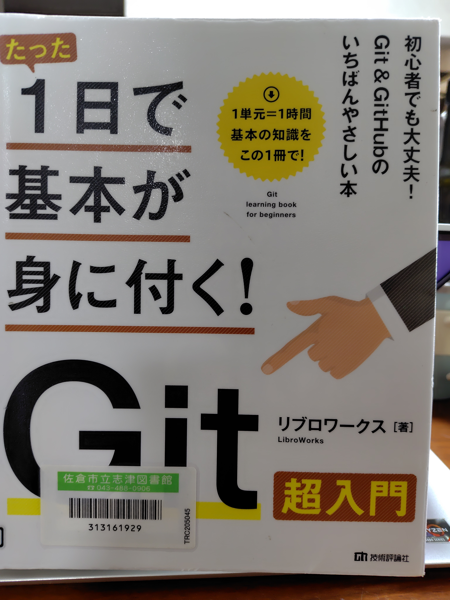

# 事務関連マニュアル
## 休日出勤について
前日までに上長と相談の上、社長に個別に申請します。

**休日出勤のタイムカードの打刻漏れ**には特に注意してください。最悪、認められないケースも発生するので、慎重に対応をお願いします。

## 経費の精算について
主な適用項目は次の通りです。
- 資料代
- 通信費
- 消耗品代

1. 資料代
2. 通信費

|適用|内容
|---|---
|資料代|図書 有料アプリ
|通信費|切手 宅急便料金
|消耗品費|文具 台所用品

## 宅配便の発送について
## プリンタについて
### プリンタドライバのインストール
ダウンロードページ（https://example.com/printer_driver）よりOSに合わせたドライバをダウンロードしてください。

macOSではシステム環境設定の「プリンタとスキャナ」を開き、「＋」ボタンをクリックしてプリンタを追加します。

## 大容量データの送受信について
## 電話、来客応対について
## ゴミ収集について

以上、これはstomoz-testがGitHub-remoteを変更したいです。
2026年4月16日　22：47
